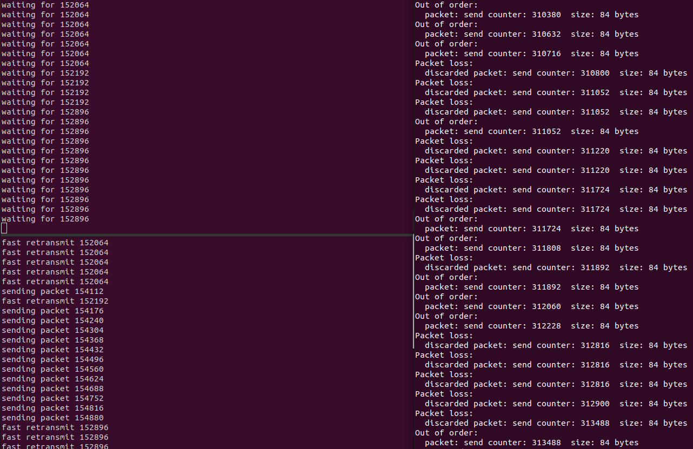

# TCUP
[](https://github.com/zackxzhang/tcup)
[](https://opensource.org/licenses/BSD-3-Clause)
[](https://github.com/zackxzhang/tcup)

*Implement TCP using UDP*


This is a toy project that demonstrates transport protocols through socket programming.
It implements `TCP` with `UDP` so that `client` can **reliably** deliver a file to `server`
over a **unreliable** network that may **drop**, **corrupt**, **reorder** and **delay** packets.

`client` reads payload from file and send to receiver, re-transmits the oldest unACKed packet (located by `send_base`) on timeout,
and stops sending when the end of the window is reached (determined by `send_base`, `window_size` and `send_next`).
To reduce chance of timeouts, `client` also fast re-transmits on triple duplicate `ACK`s.
After all payloads are sent and ACKed, `client` sends `FIN`, closes socket and file handles and shuts down.

`server` receives payload from `client`, ACKs them, and write them to file.
On receiving `FIN`, `server` closes socket and file handles and shuts down.


### Usage
- server: `python server.py -f <FILE_RECV>`
    ```
    usage: server.py [-h] [-f FILE] [-a HOST] [-i RECV_PORT]
                               [-o SEND_PORT] [-S CLIENT_HOST] [-s CLIENT_PORT]
                               [-b OBUFFER_SIZE] [-B IBUFFER_SIZE]
                               [-w WINDOW_SIZE]
    TCP server

    optional arguments:
      -h, --help            show this help message and exit
      -f FILE, --file FILE  file to receive (default: recv.txt)
      -a HOST, --host HOST  server host (default: localhost)
      -i RECV_PORT, --recv-port RECV_PORT  server recv port (default: 41194)
      -o SEND_PORT, --send-port SEND_PORT  server send port (default: 41195)
      -S CLIENT_HOST, --client-host CLIENT_HOST  client host (default: localhost)
      -s CLIENT_PORT, --client-port CLIENT_PORT  client port (default: 41190)
      -b OBUFFER_SIZE, --obuffer-size OBUFFER_SIZE  send buffer size (default: 2048)
      -B IBUFFER_SIZE, --ibuffer-size IBUFFER_SIZE  recv buffer size (default: 2048)
      -w WINDOW_SIZE, --window-size WINDOW_SIZE  recv window size (default: 65535)
    ```
- client: `python client.py -f <FILE_SEND>`
    ```
    usage: client.py [-h] [-f FILE] [-a HOST] [-i RECV_PORT] [-o SEND_PORT]
                               [-S SERVER_HOST] [-s SERVER_PORT] [-b OBUFFER_SIZE]
                               [-B IBUFFER_SIZE] [-w WINDOW_SIZE]
    TCP client

    optional arguments:
      -h, --help            show this help message and exit
      -f FILE, --file FILE  file to send (default: send.txt)
      -a HOST, --host HOST  client host (default: localhost)
      -i RECV_PORT, --recv-port RECV_PORT  client recv port (default: 41190)
      -o SEND_PORT, --send-port SEND_PORT  client send port (default: 41191)
      -S SERVER_HOST, --server-host SERVER_HOST  server host (default: localhost)
      -s SERVER_PORT, --server-port SERVER_PORT  server port (default: 41192)
      -b OBUFFER_SIZE, --obuffer-size OBUFFER_SIZE  send buffer size (default: 64)
      -B IBUFFER_SIZE, --ibuffer-size IBUFFER_SIZE  recv buffer size (default: 2048)
      -w WINDOW_SIZE, --window-size WINDOW_SIZE  send window size (default: 2048)
    ```


### Example



### Feature
- implement `TCP` header (20 bytes) including checksum, encoding and decoding
- set sequence number and `ACK` number by counting bytes
- fast re-transmit on triple duplicate `ACK`s
- keep track of valid RTT samples and compute TimeOutInterval for timer
- make `client` non-blocking, able to send data and receive `ACK`s simultaneously
- handle the corner case where `FIN` gets corrupted/lost by a long timeout
- curate buffer for `TCP` receiver
- maintain multiple pointers for windowing

|   interval                              | semantic                    |
|-----------------------------------------|-----------------------------|
| `[         0, send_base              )` | sent and ACKed              |
| `[ send_base, send_next              )` | sent but not yet ACKed      |
| `[ send_next, send_base + window_size)` | can be sent if available    |
| `[         0, recv_base              )` | received                    |


### Roadmap
- make `server` non-blocking
- implement advanced features such as delayed `ACK`s, ACK two at a time, and immediate duplicate `ACK`s
- deal with the corner cases where all data are ACKed but send socket is overflowed and cannot be used to send `FIN`
- set precisely checksum field instead of re-packing a whole new header
- refactor buffer management to reduce copying
